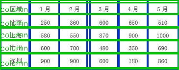

#### table_row_column_detection
java-yolov8 is used to detect the row and column of a table image


#### pretrained_weight

download：

链接：https://pan.baidu.com/s/18JRfQPsQZiFeU60j8XaTmw 
提取码：jr4i

推理：src/main/java/sy
```
public static void main(String...args) {
        String modelPath = MainTest.class.getClassLoader().getResource(PropertiesReader.get("model_path")).getPath().replaceFirst("/", "");
        String labelPath = MainTest.class.getClassLoader().getResource(PropertiesReader.get("table_det_labels_path")).getPath().replaceFirst("/", "");
        String imgPath = "D:\\project\\idea_workspace\\layout_analysis4j\\img\\test.jpeg";

        try {
            ModelDet modelDet = new ModelDet(modelPath, labelPath);
            Mat img = Imgcodecs.imread(imgPath);
            if (img.dataAddr() == 0) {
                System.out.println("Could not open image: " + imgPath);
                System.exit(1);
            }
            // run detection
            try {
                List<Detection> detectionList = modelDet.detectObjects(img);

                ImageUtil.drawPredictions(img, detectionList);
                System.out.println(JSON.toJSONString(detectionList));
                Imgcodecs.imwrite("D:\\project\\idea_workspace\\layout_analysis4j\\img\\prediction.jpg", img);
            } catch (OrtException ortException) {
                ortException.printStackTrace();
            }

        } catch (OrtException e) {
            e.printStackTrace();
        }
    }
```

<br/>
<p align="center">
  <a>
    
  </a>
</p>
<br/>


#### contact

1、github：https://github.com/jiangnanboy

2、博客：https://www.cnblogs.com/little-horse/

3、邮件:2229029156@qq.com

#### reference
https://github.com/jiangnanboy/layout_analysis

https://github.com/ultralytics/ultralytics

